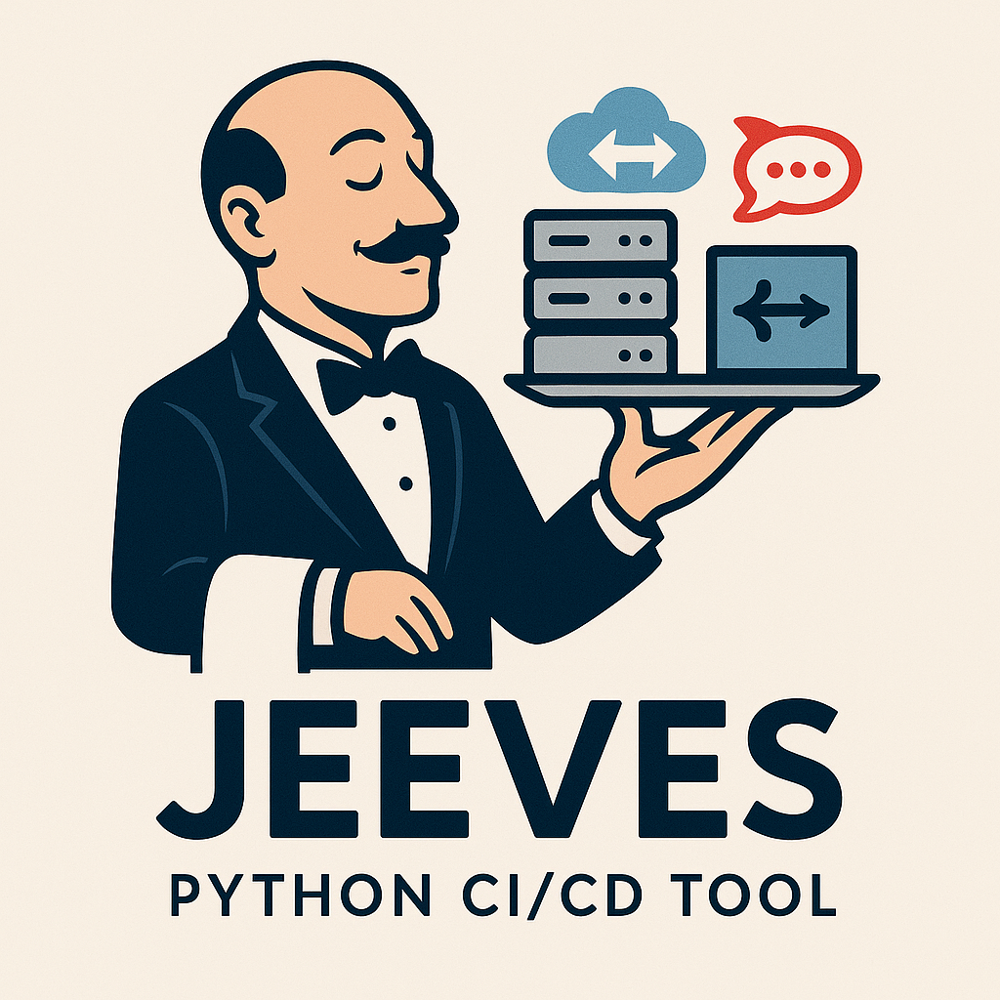

# Jeeves


Jeeves is a Python-based provisioning tool for deploying and managing AWS-based Rocket.Chat environments. It is designed with a modular pipeline architecture, making it extensible for different deployment targets (e.g., Docker, Kubernetes + Helm).

## Project Structure

```
jeeves/
├── config.py
├── pipeline.py
├── pipelines/
│   ├── basic_deployment_docker.py
│   └── k8s_deployment_helm.py
└── scripts/
    ├── rocketchat_bootstrap.sh
    ├── mongodb_bootstrap.sh
    ├── microk8s_controller_bootstrap.sh
    ├── microk8s_worker_bootstrap.sh
    └── deploy_rocketchat_helm.sh
```

* **config.py**: Loads environment variables and defines default settings (AWS credentials, region, OS version, instance type, etc.) via a dataclass.

* **pipeline.py**: Defines the abstract base class `Pipeline`, requiring implementation of the `run()` method.

* **pipelines/**: Contains concrete pipeline implementations.

  * **basic\_deployment\_docker.py**: A placeholder for a Docker-based deployment pipeline. Intended to spin up an EC2 instance, bootstrap Docker, and run Rocket.Chat via Docker Compose.
  * **k8s\_deployment\_helm.py**: Implements a skeleton pipeline for a MicroK8s + Helm-based deployment. Uses AWS helpers to launch EC2 instances for controller and worker nodes, bootstraps MicroK8s via user-data scripts, and deploys Rocket.Chat using Helm charts.

* **scripts/**: Shell scripts used by pipelines for bootstrapping services:

  * **rocketchat\_bootstrap.sh**: Boots a Rocket.Chat + Traefik stack on Ubuntu 24.04 with Docker Compose.
  * **mongodb\_bootstrap.sh**: Sets up a single-node MongoDB replica set with authentication.
  * **microk8s\_controller\_bootstrap.sh** & **microk8s\_worker\_bootstrap.sh**: Placeholders for adding full MicroK8s cluster bootstrapping logic.
  * **deploy\_rocketchat\_helm.sh**: Helper script for running Helm upgrade/install on the K8s controller.

## Configuration

Jeeves reads configuration from environment variables, with sensible defaults:

| Variable                | Description                          | Default      |
| ----------------------- | ------------------------------------ | ------------ |
| `AWS_ACCESS_KEY_ID`     | AWS access key                       | N/A          |
| `AWS_SECRET_ACCESS_KEY` | AWS secret access key                | N/A          |
| `AWS_DEFAULT_REGION`    | AWS region                           | `us-east-1`  |
| `DEFAULT_OS_VERSION`    | Ubuntu version for EC2 instances     | `24.04`      |
| `DEFAULT_INSTANCE_TYPE` | EC2 instance type                    | `t2.xlarge`  |
| `DOMAIN`                | Domain for Rocket.Chat/Traefik       | `""`         |
| `LETSENCRYPT_EMAIL`     | Email for Let's Encrypt registration | `""`         |
| `K8S_NAMESPACE`         | Kubernetes namespace for Rocket.Chat | `rocketchat` |
| `WORKER_HA`             | Enable high-availability for workers | `false`      |

## Pipelines

* **Abstract Pipeline**: Each pipeline must implement the `run()` method, which encapsulates the provisioning steps.
* **Basic Docker Pipeline**: Intended to:

  1. Launch an EC2 instance.
  2. Install Docker and Docker Compose.
  3. Run `rocketchat_bootstrap.sh` via user-data.
  4. Output the public IP and other connection details.
* **K8s + Helm Pipeline**: Current skeleton:

  1. Create a boto3 session (`session()` from `aws_helpers`).
  2. Determine the latest Ubuntu AMI (`latest_ubuntu_ami()`).
  3. Set up VPC, subnet, and security group (placeholder).
  4. Launch a controller node with `microk8s_controller_bootstrap.sh`.
  5. (Optionally) Launch worker nodes.
  6. Deploy Rocket.Chat Helm chart using `deploy_rocketchat_helm.sh`.
  7. Print a JSON summary of deployed resources.

> **Note:** The `aws_helpers` module is expected to provide:
>
> * `session()`: Returns a configured boto3 session using `config.settings`.
> * `latest_ubuntu_ami(os_version: str)`: Returns the AMI ID for the given Ubuntu version.

## Shell Scripts

The `scripts/` directory contains bash scripts for in-instance bootstrapping. They follow an idempotent, set -euo pipefail pattern and define helper functions for logging and error handling.

## Extensibility & Next Steps

1. **Implement Missing Modules**: Add `aws_helpers.py` with session management, AMI lookup, VPC/subnet/Security Group helpers.
2. **Fill Pipeline Placeholders**: Complete the `basic_deployment_docker` pipeline and flesh out networking/security steps in the K8s pipeline.
3. **Enhance Bootstrapping**: Populate MicroK8s controller/worker scripts with production-ready cluster setup (e.g., join tokens, networking).
4. **Add Logging & Monitoring**: Integrate CloudWatch, structured logging, and error recovery.
5. **Parameterization**: Allow customizing instance counts, sizes, and other parameters at runtime via CLI flags or config file.
6. **Testing & CI**: Add unit tests for pipelines, integration tests against AWS, and CI/CD workflows.

This document serves as a high-level overview of the current state and architectural design of Jeeves. From here, we can dive into specific areas for development or refinement.
